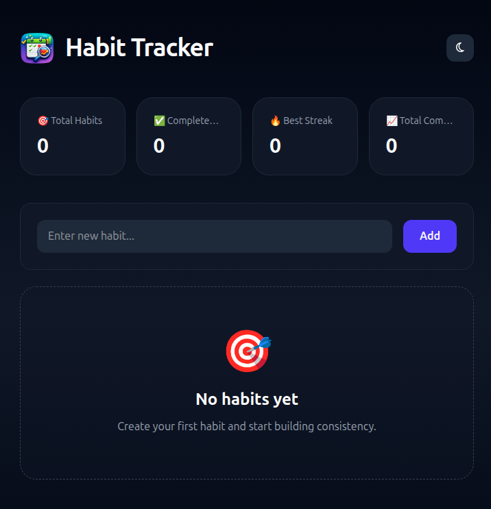

<div align="center">
  
</div>

# Habit Tracker

A simple habit tracking web app built with Vite, Tailwind CSS, and vanilla JavaScript.

## Features

- Add new habits
- Edit habit names
- Delete habits with confirmation
- Undo deletion within a short time window
- Responsive dark-themed UI
- Local browser persistence

## Tech stack

- Vite
- Tailwind CSS
- Vanilla JavaScript
- Font Awesome icons

## Project setup

```bash
npm install
```
